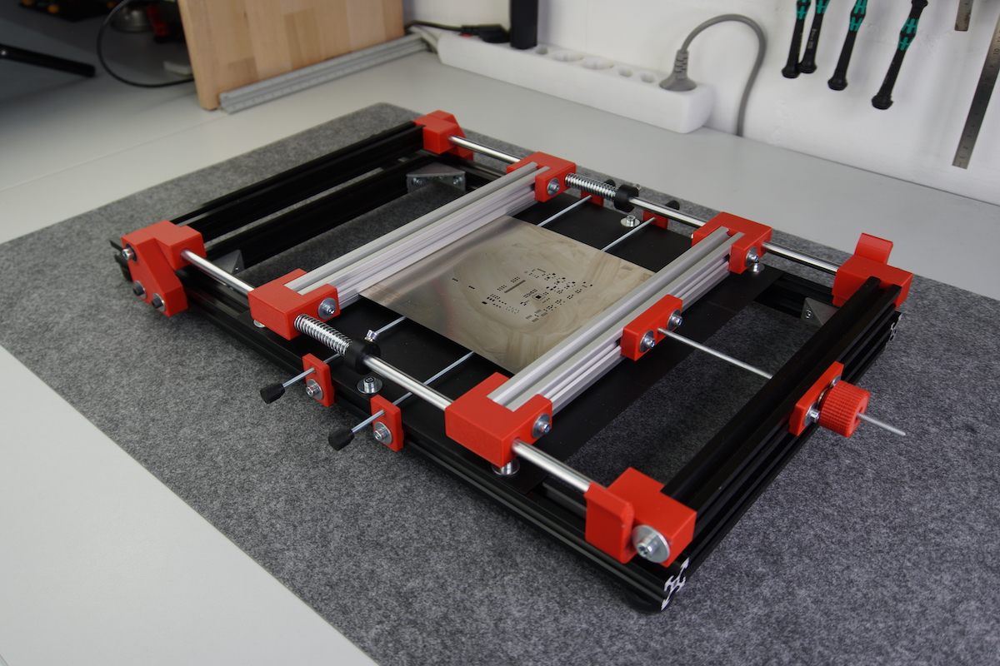
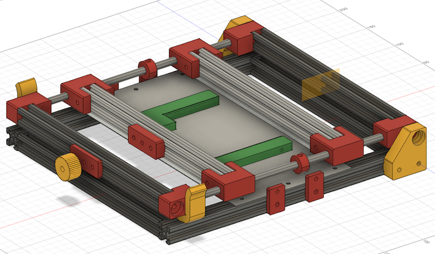
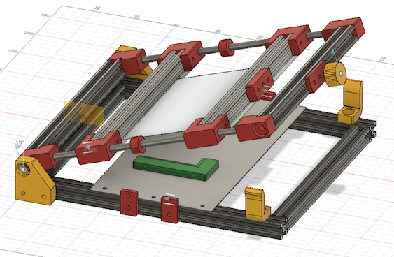
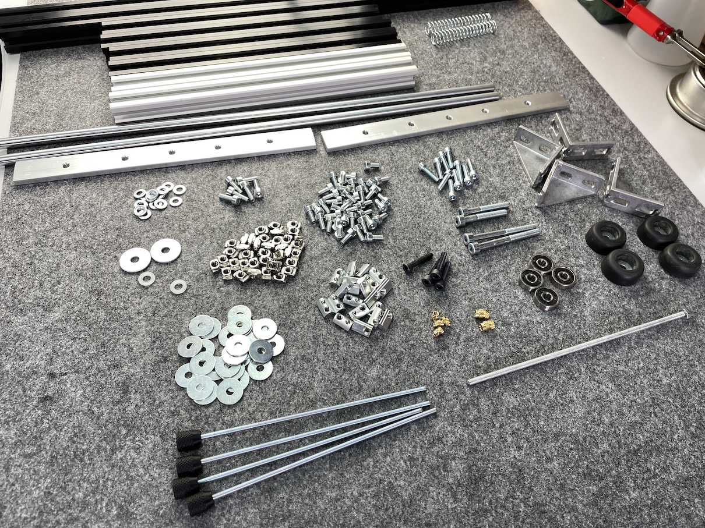

# Stencil-Jig

</a>
</a>
</a>

The Stencil-Jig is a simple DIY machine for PCB stenciling built with the Openbuilds v-slot system. Dealing with those stencils is always tricky, because they have to be aligned perfectly to get great soldering results. So far, I was always using these stencils with spare PCBs around the project PCB which are fixed in position with tape. As I am using these stencils quite often in the last time I was thinking about creating a simple jig for it - and here it is.

The stencils can be clamped into the Stencil-Jig with the inner v-slot extrusions. With all the adjustment screws on the sides and the front, the PCB and the stencil can be aligned easily to fit each other (at least this is the plan). The PCB holders are not yet the best option but they are working for now. If you have other ideas of how the PCB alignment could be done better then please let me know!

These built is inspired by two other DIY designs of Stencil printers/jigs/machines:

- Valera Perinski: https://www.thingiverse.com/thing:3429201
- Dengler Mechatronik: https://dengler-mechatronik.de/?p=560

## Assembling

I've created a detailed video about the assembly process of the StencilJig. There are notes in the video as well.

- video link here

## Extrusions

V-slot extrusions are probably not necessary here, because the v-bearings are not used. Nevertheless I have chosen them because of the availability and v-style of the slots in order to align 3D-printed parts with only one screw.

For this project you will need 5x 500mm 2020 extrusions which will be cut into these dimensions:

- 6x 250mm; width of the jig (it is probably 249,5mm, because I have just cut a 500mm extrusion in half)
- 2x 500mm; length of the jig (can be shortened later, so I leaved it as it is first)

## What to print

For the complete machine, as it is seen in the picture below, you'll need the following parts to be printed:

- 1x hinge_left.stl
- 1x hinge_right.stl
- 4x slide_mount.stl
- 4x slider.stl
- 2x slide_stopper.stl
- 2x alignment_guide.stl
- 1x screwstop_m4_incl.stl
- 1x screwstop_m4_knob.stl
- 1x knob_m4.stl
- 4x screwstop.stl
- 4x knob_m3.stl
- 1x pcb_mount_edge_1_6mm.stl
- 1x pcb_mount_straight_1_6mm.stl

## What you need

Except the 3D printed parts and the extrusions listed above you will also need the following parts:

</a>

- 2x 8mm stainless steel rod (length = length of the jig - 40mm)
- 4x 625RS bearings (16x5x5mm)
- 2x strong springs for the 8mm rod
- 4x M3 threaded rod ~100mm
- 1x M4 threaded rod ~100mm
- 1x steel plate 1mm (~290mmx250mm)
- 2x aluminium extrusion 5x20x220mm
- 4x extrusion corner 4040
- 4x M3 threaded insert
- 3x M4 threaded insert
- 40x M4 screw DIN 912 8mm
- 6x M4 screw DIN 912 12mm
- 10x M4 screw DIN 912 20mm
- 4x M4 screw DIN 912 25mm
- 2x M5 screw DIN 912 50mm
- 2x M5 screw DIN 912 30mm
- 60x M4 extrusion nuts
- 1x M4 self-locking nut
- Xx washers 4,3mm x 15mm
- 4x washers 5,3mm x 15mm
- 2x washers 5,3mm x 10mm polyamid
- (4x machine foots)

## Alignment guides

</a>

The alignment guides are there to hold the upper part of the jig (including the stencil) during the stenceling process in place, so that it doesn't move to the left or right.

## TODOs

- Alignment guide: This part should be modified with two magnets facing against each other so that the top of jig will be pushed down once inserted in the alignment guide. This will keep the stencil down.
- The PCB holders should be optimized. At least they should be wider and on the same high as the PCB so that the stencil won't bent.
- Springs should be stronger. Or exchanging the springs with a tightener (knob as in the front) on the back?!
